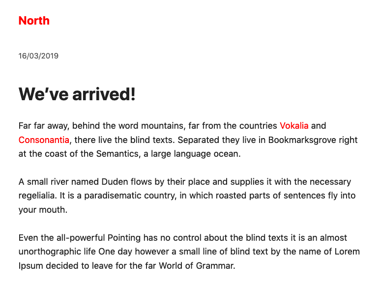

# North

A [Typography.js](https://kyleamathews.github.io/typography.js/) theme.

## Installation
```sh
yarn add typography typography-theme-north
```

## Usage
```js
import Typography from 'typography';
import North from 'typography-theme-north';

const typography = new Typography(North);

if (process.env.NODE_ENV !== 'production') {
  typography.injectStyles();
}

export default typography;
export const {rhythm} = typography;
export const {scale} = typography;
```

## Preview:


